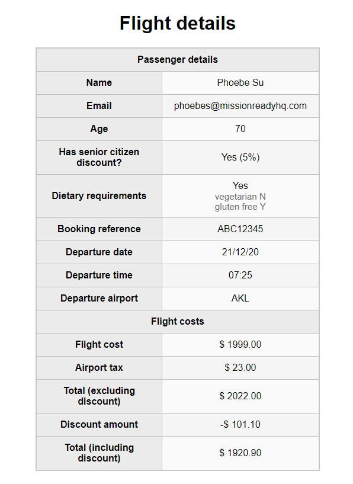

# 01 Exercise - Variables, Types & Operations

## Brief

Display a customers Flight Details by completing the required variables in JavaScript

## Rationale

Practice declaring JavaScript variables, and assigning them values. This will build muscle memory, get you familiar with the terms used when describing variables, and allow you to practice using operators in JavaScript.

## Getting Started

1. `clone` the exercise repository to your local computer.

- If you are not too sure how to do it, please follow this [video](https://www.loom.com/share/8a0d420720a94cb18021c2f418b19ae8?sid=b9435f7c-afd8-4031-88a3-44341f0e6b2f)
  to see how to git clone the repository into your device.

2. The code for this exercise should go into `/Submission/static/js/script.js`.

## Instructions Part A - Write variables in JavaScript

1. Open `/Submission/index.html` in Live Server, so it opens in your browser. You `**do not**` need to change or edit this file in VS Code.
2. Open `/Submission/js/script.js` in VS Code
3. Underneath each comment block, complete the instructions in the comment. After each variable declaration, you should see the web page update with the value you set
4. Complete all the instructions in `script.js` until your web page looks like the brief

**Acceptance criteria**

- The values populated in your web page match the values from the screenshot in the brief.

---

# Submit your Exercise

- [ ] Push your code with your folder back to this Github Repository
- [Tutorial Video for push your code](https://www.loom.com/share/e6fb52378eaf4636b62fc302f15b5aeb?sid=e6f68797-9dab-42b5-ae76-745316994fa6)

---

## Exercise answer walkthrough

- [Variables and Operations exercise walkthrough](https://www.loom.com/share/67d38be002d14765907e599c82cedada)
